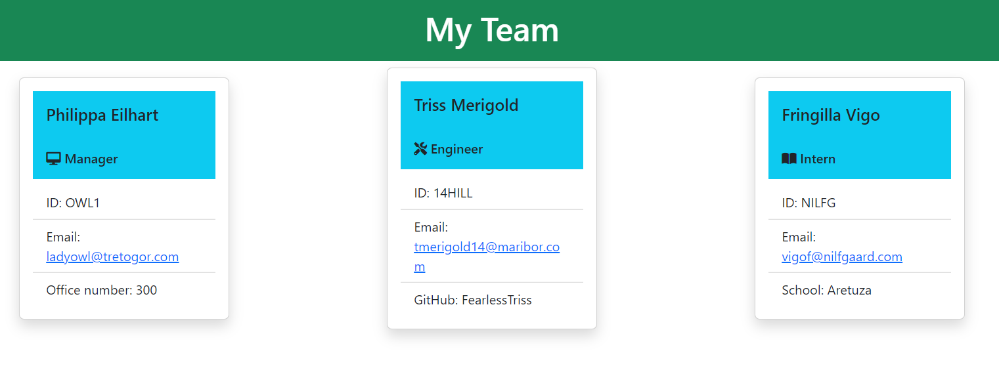
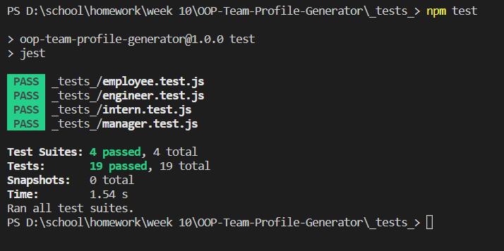
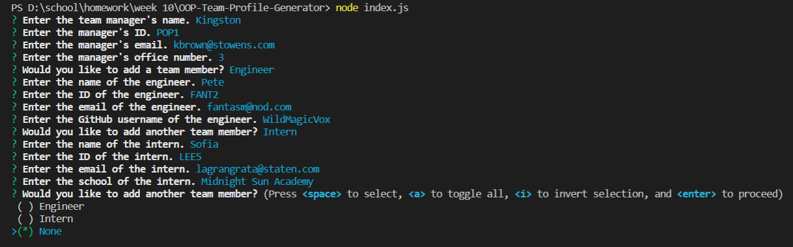

# Creating a Team Profile Generator with Object-Oriented Programming

## Description
This app uses the Inquirer modele within Node to provide the user with a series of prompts that creates an HTML page with information on team members. Starting with a team manager, build your team profile by adding engineers and/or interns along with other pertinent information. Test suites are also included, meant to be run through the Jest module. 

This project was created with the purpose of utilizing object-oriented programming and test code. 

### Technologies 
- HTML
- Bootstrap 
- Javascript
- Node.js
- Inquirer
- Jest

### Installation Instructions
Make sure you have Node.js installed. Open the application folder and go to your chosen terminal. Within the terminal, run this code to install Inquirer: 
```
npm i
```
If you would like to run tests, you must explicitly enter Jest. 
```
npm i jest
```

Start the application by entering this command: 
```
node index.js
```
To run the test suites, go to the "test" folder and run this command within the terminal: 
```
npm test
```

### Usage Instructions
Once the application has been started, a series of prompts will open in the terminal that will ask questions for the user to answer. All team member types will be asked these types of questions: name, ID, and email. Team managers are asked the unique question of what their office number is, engineers are asked for their GitHub usernames, while interns are uniquely asked for the name of their schools. There can only be one manager, but you may add as many engineers and interns as you like. When you have no more team members to add, the final HTML page will be generated within the folder in the application titled "dist". 

[Watch a demo video.](https://youtu.be/0AMYDFnwX9U)

### Screenshots






## License
This project is MIT licensed. 

## Tests
Test suites are included within the test folder for each class. Open Jest in order to run them. 

